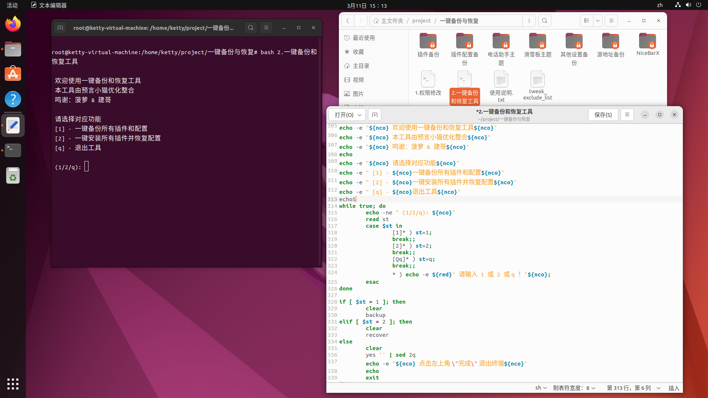

# Tweak_Backup

<!-- PROJECT SHIELDS -->

[![Forks][forks-shield]][forks-url]
[![Stargazers][stars-shield]][stars-url]
[![Issues][issues-shield]][issues-url]
[![MIT License][license-shield]][license-url]

<!-- PROJECT LOGO -->
 

  <h3 align="center">欢迎使用一键备份和恢复工具</h3>
  

    适合xina和多巴胺越狱的插件及其配置的一键备份恢复工具
     
    <a href="https://github.com/Ketty0725/Tweak_Backup"><strong>探索本项目的文档 »</strong></a>
     
     
    <a href="https://github.com/Ketty0725/Tweak_Backup/issues">报告Bug</a>
    ·
    <a href="https://github.com/Ketty0725/Tweak_Backup/issues">提出新特性</a>
  

本工具由预言小猫优化整合

### 上手指南
使用本工具之前请先执行 "1.权限修改" 文件！

### 预览

### 演示
https://github.com/Ketty0725/Tweak_Backup/assets/103920238/73d24725-7625-40b9-88f2-72213436a7b6

### 鸣谢

- 菠萝
- 建哥

<!-- links -->
[your-project-path]:Ketty0725/Tweak_Backup
[forks-shield]: https://img.shields.io/github/forks/Ketty0725/Tweak_Backup.svg?style=flat-square
[forks-url]: https://github.com/Ketty0725/Tweak_Backup/network/members
[stars-shield]: https://img.shields.io/github/stars/Ketty0725/Tweak_Backup.svg?style=flat-square
[stars-url]: https://github.com/Ketty0725/Tweak_Backup/stargazers
[issues-shield]: https://img.shields.io/github/issues/Ketty0725/Tweak_Backup.svg?style=flat-square
[issues-url]: https://img.shields.io/github/issues/Ketty0725/Tweak_Backup.svg
[license-shield]: https://img.shields.io/github/license/Ketty0725/Tweak_Backup.svg?style=flat-square
[license-url]: https://github.com/Ketty0725/Tweak_Backup/blob/main/LICENSE
