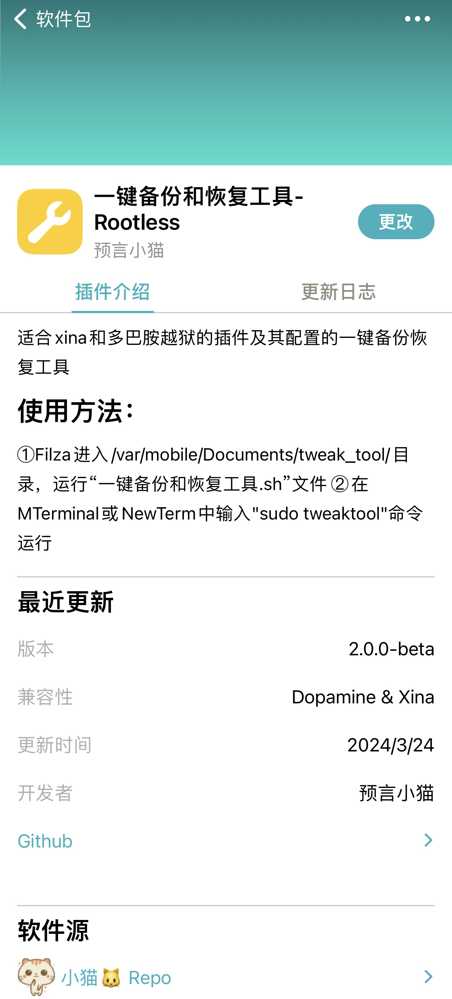
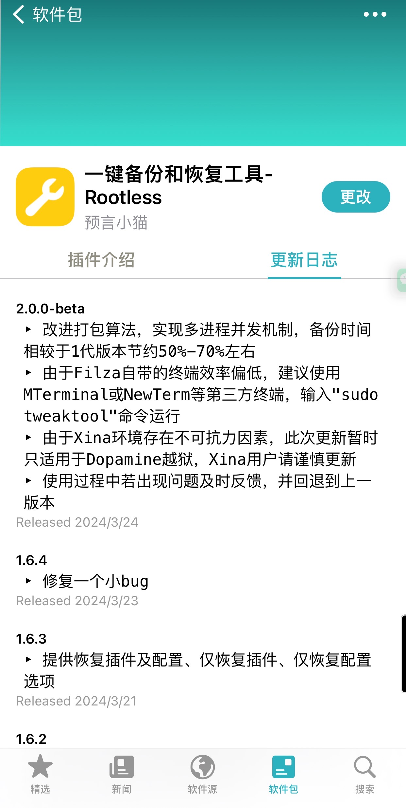

<!-- PROJECT LOGO -->

   
  <h2 align="center">欢迎使用一键备份和恢复工具</h2>
  

    适合xina和多巴胺越狱的插件及其配置的一键备份恢复工具
     
    <a href="https://github.com/Ketty0725/Tweak_Tool"><strong>探索本项目的文档 »</strong></a>
     
     
    <a href="https://github.com/Ketty0725/Tweak_Tool/issues">报告Bug</a>
    ·
    <a href="https://github.com/Ketty0725/Tweak_Tool/issues">提出新特性</a>
  

<!-- PROJECT SHIELDS -->

[![Forks][forks-shield]][forks-url]
[![Stargazers][stars-shield]][stars-url]
[![Issues][issues-shield]][issues-url]
[![MIT License][license-shield]][license-url]

本工具由预言小猫优化整合

如果本工具对你有所帮助，请帮忙点点star🌟

### 上手指南
sileo或saily添加软件源：https://ketty0725.github.io/repo/

1️⃣Filza进入/var/mobile/Documents/tweak_tool/目录，运行“一键备份和恢复工具.sh”文件

2️⃣在MTerminal或NewTerm中输入"sudo tweaktool"命令运行 

由于Filza自带的终端效率偏低，建议使用方法2️⃣

### 插件介绍

### 更新日志

### 演示
[demo](https://github.com/Ketty0725/Tweak_Tool/assets/103920238/92a00d18-2751-4268-a5ab-0a9a0dc51b68)

### 鸣谢

- [菠萝](https://discord.com/invite/UvHZz3HfN9)
- 建哥

<!-- links -->
[your-project-path]:Ketty0725/Tweak_Tool
[forks-shield]: https://img.shields.io/github/forks/Ketty0725/Tweak_Tool.svg?style=flat-square
[forks-url]: https://github.com/Ketty0725/Tweak_Tool/network/members
[stars-shield]: https://img.shields.io/github/stars/Ketty0725/Tweak_Tool.svg?style=flat-square
[stars-url]: https://github.com/Ketty0725/Tweak_Tool/stargazers
[issues-shield]: https://img.shields.io/github/issues/Ketty0725/Tweak_Tool.svg?style=flat-square
[issues-url]: https://img.shields.io/github/issues/Ketty0725/Tweak_Tool.svg
[license-shield]: https://img.shields.io/github/license/Ketty0725/Tweak_Tool.svg?style=flat-square
[license-url]: https://github.com/Ketty0725/Tweak_Tool/blob/main/LICENSE
